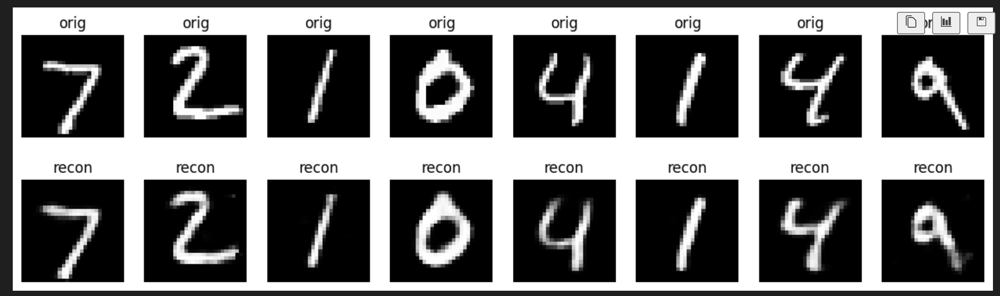
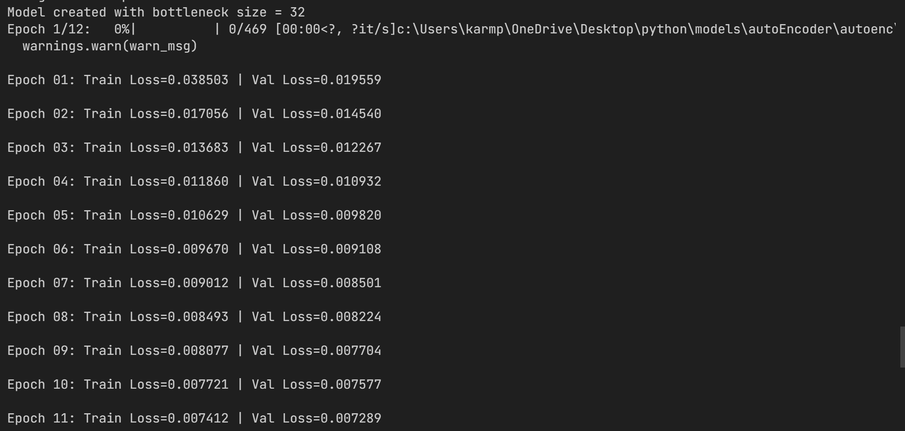

# Autoencoder 
 



## How this notebook solves the problem — overview

- Dataset: MNIST (training + test split) loaded via torchvision, normalized to [0,1] using `transforms.ToTensor()`.
- Model: A fully connected (MLP) autoencoder built from custom linear layers and simple custom activation functions.
- Training: Mean Squared Error (MSE) loss with Adam optimizer. Training prints per-epoch losses and optional validation loss.
- Visualization: Shows original and reconstructed images side-by-side for qualitative inspection.

## Architecture — detailed step-by-step description

The model is implemented in the `Autoencoder` class and composed from smaller custom modules. Below are the components and how data flows through the network.

1. Custom components

- `CustomLinearLayer` (inherits `nn.Module`)
  - Purpose: Simple implementation of a linear (fully connected) layer using a `nn.Parameter` for weights and optional bias.
  - Constructor args: `in_features`, `out_features`, `bias=True`.
  - Initialization: weights are initialized uniformly in [-limit, limit] where limit = sqrt(6 / (fan_in + fan_out)). Bias, if present, is zeroed.
  - Forward: Performs `x.matmul(weight.t())` and adds bias if present.

- `CustomReLU` (inherits `nn.Module`)
  - Purpose: ReLU activation with an optional `inplace` flag. Uses `torch.where` to replace negative values with zeros.

- `CustomSigmoid` (inherits `nn.Module`)
  - Purpose: Sigmoid activation implemented directly with `torch.exp` for the decoder output to squash values into (0,1).

2. Autoencoder topology (encoder -> bottleneck -> decoder)

- Input: Flattened 28x28 image (784-dimensional vector).

Encoder (maps input to compressed bottleneck):
- `encoder_fc1`: `CustomLinearLayer(784, 256)`
- `encoder_act1`: `CustomReLU()`
- `encoder_fc2`: `CustomLinearLayer(256, 64)`
- `encoder_act2`: `CustomReLU()`
- `encoder_fc3`: `CustomLinearLayer(64, bottleneck_dim)`
- Output of `encoder_fc3` is the bottleneck vector (size controlled by `bottleneck_dim`, default 32). No activation is applied on the bottleneck so it remains unbounded.

Decoder (reconstructs the input from bottleneck):
- `decoder_fc1`: `CustomLinearLayer(bottleneck_dim, 64)`
- `decoder_act1`: `CustomReLU()`
- `decoder_fc2`: `CustomLinearLayer(64, 256)`
- `decoder_act2`: `CustomReLU()`
- `decoder_fc3`: `CustomLinearLayer(256, 784)`
- `decoder_act3`: `CustomSigmoid()` — final outputs are squashed into (0,1), matching normalized image pixel range.

Forward pass summary:
- encode(x): x -> fc1 -> relu -> fc2 -> relu -> fc3 -> bottleneck
- decode(z): z -> fc1 -> relu -> fc2 -> relu -> fc3 -> sigmoid -> reconstruction
- forward(x): recon = decode(encode(x))

## Training details

- Loss: Mean Squared Error (MSE) between flattened input and reconstructed output.
- Optimizer: Adam (default betas) with learning rate default 1e-3.
- Batch size: configurable; example in notebook uses 128.
- Epochs: configurable; example uses 12.
- Device handling: notebook detects CUDA availability and uses `torch.device("cuda" if torch.cuda.is_available() else "cpu")`. The model and tensors are moved to the selected device.

Training loop specifics (as implemented in `train_autoencoder`):
- Model is set to `train()`.
- For each batch: move images to device, flatten, zero gradients, forward pass, compute MSE loss, backward(), optimizer.step().
- Training prints per-epoch averaged training loss (sum of batch loss * batch_size divided by dataset size). If a validation DataLoader is provided, validation loss is also computed and printed.

## Visualization

The `show_reconstructions` function:
- Takes `model`, `dataloader`, `device`, and `num_images`.
- Moves the model to device and sets `eval()`.
- Grabs the first batch from the dataloader, selects `num_images`, flattens, computes reconstructions, reshapes to (N, 1, 28, 28), and plots originals above reconstructions using matplotlib.

## How to run (quick start)

1. Create or activate a Python environment (notebook already includes a `pyvenv` folder with scripts). Make sure Python 3.10+ and PyTorch are installed. Example for Windows (cmd.exe) using venv:

```
python -m venv .\autoenc
.\autoenc\Scripts\activate.bat
pip install --upgrade pip
pip install torch torchvision matplotlib tqdm
```

2. Run the notebook `Model.ipynb` with Jupyter Notebook / JupyterLab, or convert the main block into a script and run it. The notebook includes an `if __name__ == "__main__":` block that constructs the model, creates DataLoaders, trains the autoencoder, and shows reconstructions.

3. Key hyperparameters you can modify inside the notebook:
- `BATCH_SIZE` (default 128)
- `EPOCHS` (default 12)
- `LR` (default 1e-3)
- `BOTTLENECK_DIM` (default 32)

## Notes, caveats and possible improvements

- The model uses custom linear and activation implementations for replacing `CustomLinearLayer` with `nn.Linear` and activations with `nn.ReLU`/`nn.Sigmoid` will produce equivalent behavior and may use optimized kernels.
- For faster training on large datasets, consider adding weight initialization consistent with the activations used (e.g., Kaiming for ReLU), batch normalization, dropout, or switching to convolutional autoencoders for image data.
- The current bottleneck is unbounded; if you want bounded encodings, add an activation (e.g., `tanh`) or use variational autoencoder (VAE) techniques for probabilistic latent variables.
- For denoising, train with noisy inputs and clean targets by applying transforms that add noise to the input images.
- Add command-line arg parsing or a small script wrapper to run experiments programmatically.

## Files in this folder

- `Model.ipynb` — The Jupyter notebook containing model definition, training, and visualization.
- `data/` — Folder where MNIST data will be downloaded by torchvision.

